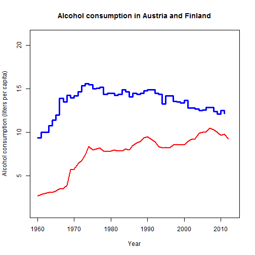

## What's the app about...

<br>
<br>
<br>
It's an R Shiny application showing alcohol consumption across some OECD countries.
<br>
(Honestly, I wanted to make an app on whisky consumption, but the complete data was hard to find).

<br>
The data used in this app comes from OECD website: http://stats.oecd.org/

--- .class #id

## What's happening there...

After user chooses two countries a plot is shown on the right side panel:

 


--- .class #id

## What's happening there... (cont'd)

Below the plot a summary data is printed:


```
## [1] "Austria"
```

```
##    Min. 1st Qu.  Median    Mean 3rd Qu.    Max.    NA's 
##    9.40   12.78   14.15   13.60   14.50   15.60       2
```

```
## [1] "Finland"
```

```
##    Min. 1st Qu.  Median    Mean 3rd Qu.    Max.    NA's 
##   2.700   7.400   8.200   7.647   9.200  10.500       1
```

--- .class #id

## A list of countries in the dataset


```
##  [1] "Australia"       "Austria"         "Belgium"        
##  [4] "Canada"          "Chile"           "Czech_Republic" 
##  [7] "Denmark"         "Estonia"         "Finland"        
## [10] "France"          "Germany"         "Greece"         
## [13] "Hungary"         "Iceland"         "Ireland"        
## [16] "Israel"          "Italy"           "Japan"          
## [19] "Korea"           "Luxembourg"      "Mexico"         
## [22] "Netherlands"     "New_Zealand"     "Norway"         
## [25] "Poland"          "Portugal"        "Slovak_Republic"
## [28] "Slovenia"        "Spain"           "Sweden"         
## [31] "Switzerland"     "Turkey"          "United_Kingdom" 
## [34] "United_States"
```
